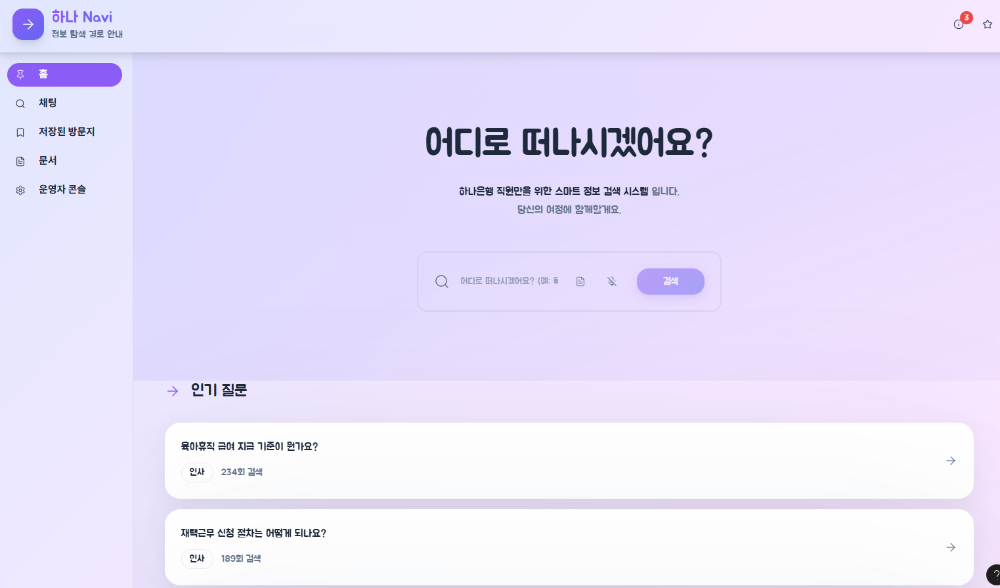

# hana-navi-chatbot-design
사내 포털용 AI 챗봇 **‘하나 내비’**의 디자인/프로토타입. 내비게이션 메타포로 질문 → 근거 → 담당자까지 안내하는 근거기반 Q&amp;A 경험(UI/UX·모션·접근성 포함). Figma Make 산출물과 GitHub Pages 데모를 관리합니다.

# 하나 내비 (Hana Navi) — 사내 AI 내비게이션 챗봇 프로토타입
> 딱딱한 은행 이미지에서 벗어나 **편안하면서도 혁신적인** 정보 탐색 경험.  
> “질문 → 근거 → 담당자”까지 한 번에, **내비게이션처럼** 안내합니다.



[▶ Live Demo([링크](https://effort-bolt-90644136.figma.site/))](#) · [🎨 Figma Prototype](#) · [🧭 Demo Script](docs/DEMO_SCRIPT.md)

---

## Why — 어떤 문제를 푸나?
사내 포털은 **어느 게시판에서 검색해야 하는지**를 알고 있어야 했습니다.  
**하나 내비**는 게시판을 몰라도 **자연어로 질문**하면 문서/첨부까지 찾아 **근거 기반**으로 답합니다.  
은행 전 직원(다양한 직급·연령)이 쓰는 만큼 **가독성·접근성·안전성**을 중심에 두었습니다.

---

## 핵심 컨셉
- **내비게이션 메타포**: 목적지(질문) → 경유지(후속 질문/근거) → 도착(담당자/정책 확정)
- **품질을 계기판처럼**: 응답시간·근거율·PII 탐지율을 실시간 표기 → “AI를 잘 쓴 느낌”을 시각화
- **문서 중심 Q&A**: 제목뿐 아니라 **첨부 내부**(PDF/표/OCR)까지 탐색

---

## 기능 (MVP / V1+ / WOW)
### 1) 대화·검색(챗 뷰)
- **[MVP] 목적지 입력창**: 자연어 질문(엔터/마이크 선택), placeholder `어디로 가시나요? (예: 육아휴직 급여 기준)`
- **[MVP] 멀티턴 대화(경유지 추가)**: 맥락 유지, “경유지로 추가”
- **[MVP] 응답 포맷 표준화**: ①요약 ②핵심 근거(문서/섹션/페이지) ③원문 미리보기 ④다음 경유지
- **[MVP] 근거 보기 패널(지도 팝업)**: 클릭 시 문서 내 하이라이트 위치로 점프(페이지/줄/표 셀)
- **[MVP] 파일 드롭영역(휴대품 싣기)**: PDF/DOCX/PPT/XLS 첨부 → “이 문서에서 찾아줘”
- **[V1+] 질문 모드 토글(차선 선택)**: 빠른답 / 정밀검증 / 요약전용
- **[V1+] 부서/기간/문서유형 필터(차로 가이드)**
- **[WOW] 음성 질의 & TTS(보이스 내비)**

### 2) 품질·신뢰(계기판)
- **[MVP] 품질 계기판**: ⏱ 응답 3초, 📚 근거율 95%, 🔒 PII 0% 표시(툴팁)
- **[MVP] 출처 신호등**: 공식/비공식/권한제한 배지
- **[V1+] 유사질문 대비도(혼잡도)**: 해결률%, 최근 업데이트일
- **[WOW] 품질 알람(점검등)**: 근거 부족/PII 탐지 시 경고, 마스킹·재질문 제안

### 3) 저장·이력(‘저장된 방문지’)
- **[MVP] 보관하기**: 현재 Q&A 요약 저장, 태그 자동 추천(#인사 #복지)
- **[MVP] 저장된 방문지 목록**: 카드형(요약/날짜/근거 수), 검색·정렬
- **[MVP] 편집하기**: 제목/요약/태그/개인 노트
- **[V1+] 폴더/핀 고정, 최근 경로 보기**
- **[WOW] 여정 재실행**: 저장된 질의 체인을 한 번에 재실행(갱신 비교)

### 4) 첨부·문서 뷰어
- **[MVP] PDF 인앱 뷰어**: 썸네일, 키워드 하이라이트, 표/도표 인덱스
- **[MVP] 문서 메타**: 부서/개정일/유형/권한 배지
- **[V1+] 표/리스트 추출 미리보기**(복사 버튼)
- **[V1+] 스캔 OCR 표시**(인식 신뢰도)
- **[WOW] 다중문서 라우팅**: 첨부를 경유지 탭으로 비교

### 5) 담당자 연계(에스컬레이션)
- **[MVP] 담당자 확인하기**: 팝오버(부서/내선/업무시간/대체담당), “문의 메일 초안”
- **[MVP] 담당자에게 보내기**: Q&A 요약/근거 링크 공유(메일/메신저)
- **[V1+] 슬롯 예약**: 15분 상담 캘린더 제안
- **[WOW] 담당자 추천**: 질문 유형별 Top3

### 6) 피드백·학습 루프
- **[MVP] 도움됨/안됨 + 사유**(부정확/낡음/권한/형식), 자유 텍스트
- **[V1+] 수정 제안 모드**: 문서 오류 신고 → 상태 표시
- **[WOW] A/B 응답 비교**: “다른 경로 보기”로 병렬 비교

### 7) 접근성·사용성
- **[MVP] 키보드 단축키**(새 질문/보관/근거 토글), 다크모드, 폰트 크기
- **[MVP] 오류 회복 U턴**: 컨텍스트 롤백
- **[V1+] 다국어 UI(한/영)·반응형
- **[WOW] 30초 튜토리얼(코치마크)**

### 8) 보안·컴플라이언스(표면)
- **[MVP] PII 자동 마스킹 미리보기**
- **[MVP] 권한 알림 배너**
- **[V1+] 세션 잠금**
- **[WOW] 민감도 라벨**(일반/내부/대외비)

### 9) 탐색·발견(내비 감성)
- **[MVP] 추천 목적지**, **자동 완성(예측 경로)**
- **[V1+] 주제 맵(지형도)**
- **[WOW] 상황별 프리셋 경로**(신규입사자/인사담당자)

### 10) 알림·공유
- **[MVP] 링크 복사/이미지 공유**(사내 메신저 호환)
- **[V1+] 변경 알림**(저장된 방문지 근거 문서 개정)
- **[WOW] 팀 보관함**(권한 기반 협업)

### 11) 운영자·SME(데모용)
- **[V1+] 지식 인덱스 상태 패널**, **질문 열지도**
- **[WOW] 품질 리그 테이블**(부서별 지표 랭킹)

---

## 재미 요소(브랜딩)
- **경로 요약 미니맵**: 답변 상단에 “질문→근거1→근거2→담당자” 라인  
- **보관 스탬프 애니메이션**: 첫 저장 시 “첫 방문”  
- **품질 신호등**: 3초 이내 초록 점등, 초과 시 노랑 깜빡임  
- **내비 보이스 한 줄**: “우측에 근거 문서가 있습니다.”(TTS Off 기본)

---

## 스크린샷
- `/docs/screens/chat.png` — 챗 뷰  
- `/docs/screens/evidence.png` — 근거 패널  
- `/docs/screens/pdf.png` — PDF 뷰어  
- `/docs/screens/saved.png` — 저장된 방문지

---

## 데모 방법
1. **시작**: 홈 → 질문 입력(“육아휴직 급여 기준”)  
2. **근거 확인**: 근거 보기 클릭 → PDF 하이라이트  
3. **보관**: 보관하기 → 저장된 방문지 생성(스탬프)  
4. **에스컬레이션**: 담당자 확인하기 → 메일 초안  
5. **비교**: 다른 경로 보기 → A/B 응답 비교

> 상세 진행 대본은 [`docs/DEMO_SCRIPT.md`](docs/DEMO_SCRIPT.md) 참고.

---

## 실행 & 배포
> 이 리포는 **Figma Make로 생성된 웹 프로토타입**을 위한 문서/정적 자산 저장소입니다.

### 로컬 미리보기(정적 번들일 경우)
```bash
# /dist 또는 /build에 index.html이 있다면
npx serve dist       # 또는: npx http-server dist
